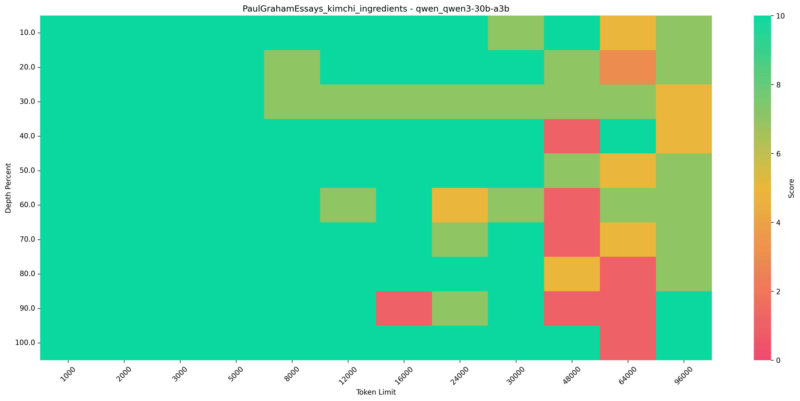
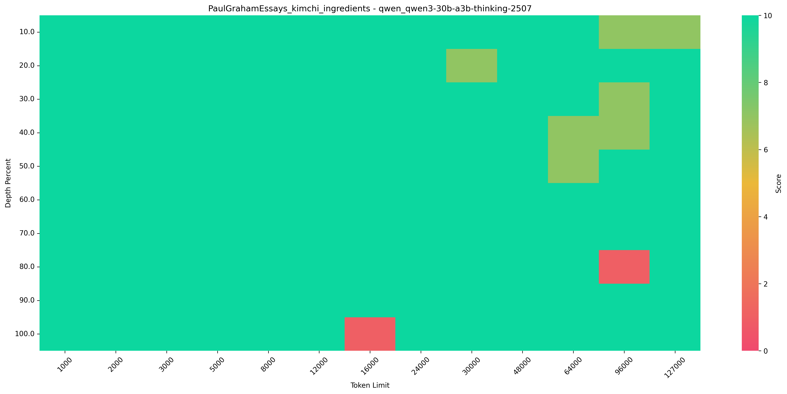

# dnotitia NIAH

dnotitia NIAH is a framework for testing the long-text understanding capabilities of large language models. It tests
whether models can accurately retrieve and understand specific information by inserting "needles" (key information) into long texts.

## Installation

### 1. Clone the Repository

```bash
$ git clone https://github.com/dnotitia/dnotitia-NIAH.git
$ cd dnotitia-NIAH
```

### 2. Create Virtual Environment

```bash
# Create virtual environment using uv
$ uv v --python=3.13 --seed

# Activate virtual environment
$ source .venv/bin/activate
```

### 3. Install Dependencies

```bash
$ uv pip install -r requirements.txt
```

### 4. Configuration

#### Configure model_config.yaml

The `config/model_config.yaml` file already contains configurations for common models. To add new models, follow this format:

```yaml
models:
  your-model-name:
    api_key: YOUR_API_KEY_ENV_VAR  # Environment variable name in .env
    base_url: YOUR_API_BASE_ENV_VAR  # Environment variable name in .env
    max_context: 32000  # Maximum context window size of the model
```

During experiments, the system will automatically constrain based on the model's maximum context length setting. For
example, if the actual model's maximum length is 16K, context experiment settings exceeding the maximum length will be
automatically filtered out.

#### Create .env File

Create a `.env` file in the root directory and configure it with your API keys and base URLs according to your model settings:

```bash
OPENROUTER_API_KEY=your_openrouter_api_key_here
OPENROUTER_API_BASE=https://openrouter.ai/api/v1

LOCAL_API_KEY=your_local_api_key_here
LOCAL_API_BASE=http://localhost:8000/v1
```

### Test Case Description

Currently, all test cases are defined in `config/needle_cases.yaml`.
Specifically, each test case contains the following components, and users can also customize cases:

```yaml
case_name: # Test case name
  needles: # "Needles" (key information) to insert into text
    - "Content of needle 1"
    - "Content of needle 2"
    # More needles can be added
  question: "Question to ask the model"  # Used to test if the model can retrieve information from needles
  true_answer: "Correct answer"  # Standard for evaluating the model's response
```

For example, here's a Korean NIAH test case we created:

```yaml
kimchi_ingredients:
  needles:
    - " 배추는 맛있는 김치의 주요 재료 중 하나입니다. "
    - " 고춧가루는 맛있는 김치의 주요 재료 중 하나입니다. "
    - " 마늘은 맛있는 김치의 주요 재료 중 하나입니다. "
    - " 소금은 맛있는 김치의 주요 재료 중 하나입니다. "
  question: "맛있는 김치를 만드는 데는 어떤 재료가 필요할까요?"
  true_answer: "배추, 고춧가루, 마늘, 소금은 맛있는 김치를 만드는 데 필요한 재료입니다."  
```

## Usage

### Running LLM Multi-Needle Testing

Running LLM multi-needle testing evaluates the ability of large language models to retrieve information at different
context lengths and depth positions. Here are some typical usage scenarios:

#### Basic Usage

```bash
# Simplest usage - test a single model and single case
python run_llm_multi_needle_test.py --model-names dnotitia/DNA-2.0-30B-A3B --case-names kimchi_ingredients

# Test multiple models
python run_llm_multi_needle_test.py --model-names dnotitia/DNA-2.0-30B-A3B dnotitia/DNA-2.0-4B --case-names kimchi_ingredients

# Test multiple cases
python run_llm_multi_needle_test.py --model-names dnotitia/DNA-2.0-30B-A3B dnotitia/DNA-2.0-4B --case-names kimchi_ingredients pizza_ingredients
```

#### Custom Test Parameters

```bash
# Custom context lengths and depth percentages
python run_llm_multi_needle_test.py \
    --model-names dnotitia/DNA-2.0-4B \
    --case-names kimchi_ingredients \
    --context-lengths 3000 8000 16000 \
    --document-depth-percents 20 50 80

# Adjust concurrent requests and sleep time
python run_llm_multi_needle_test.py \
    --model-names dnotitia/DNA-2.0-4B \
    --case-names kimchi_ingredients \
    --num-concurrent-requests 3 \
    --base-sleep-time 1.0

# Generate context only without executing tests
python run_llm_multi_needle_test.py \
    --model-names dnotitia/DNA-2.0-4B \
    --case-names kimchi_ingredients \
    --only-context
```

#### Command Line Arguments

Required arguments:

- `--model-names`: List of model names to test, e.g., dnotitia/DNA-2.0-4B
- `--case-names`: List of case names to test, e.g., kimchi_ingredients pizza_ingredients rainbow_potion

Optional arguments:

- `--eval-model`: Evaluation model name, defaults to "gpt-4o". The evaluation model also needs to be configured in
  model_config.yaml
- `--context-lengths`: List of context lengths, defaults to multiple lengths from 1K, 3K, 8K, 12K, 16K, 24K, 30K,
  48K...127K...999K
- `--document-depth-percents`: List of document depth percentages, defaults to [10,20,...,100]
- `--num-concurrent-requests`: Number of concurrent requests, defaults to 1
- `--final-context-length-buffer`: Final context length buffer, defaults to 300
- `--base-sleep-time`: Base sleep time (seconds), defaults to 0.5, to avoid exceeding model request limits
- `--haystack-dir`: Haystack directory, defaults to "PaulGrahamEssays"
- `--depth-interval-type`: Depth interval type, defaults to "linear"
- `--no-save-results`: Don't save test results
- `--no-save-contexts`: Don't save context files
- `--no-print-status`: Don't print progress status
- `--only-context`: Only generate context files
- `--no-dynamic-sleep`: Disable dynamic sleep

## Result Analysis

Test results will be saved in the following directories:

- LLM test results: `llm_multi_needle/results/`

### Using Visualization Scripts for Result Analysis

The project provides visualization processing scripts:

```bash
# Process LLM test results
python Needle_vis_llm.py
```

This script processes LLM multi-needle test results, generates heat maps, and summarizes data. The script generates heat maps in the results directory and `visualizations` subdirectory, and consolidates all experiment data into CSV files for further analysis.

Below is an example heat map visualization generated for the [Qwen3 30B A3B](https://huggingface.co/Qwen/Qwen3-30B-A3B) model:



As shown in the visualization above, the Qwen3 30B A3B model struggled with the NIAH test, particularly in long context scenarios. In contrast, the [Qwen3 30B A3B Thinking 2507](https://huggingface.co/Qwen/Qwen3-30B-A3B-Thinking-2507) model demonstrates significantly better performance:




# References

This project builds upon and extends the following excellent open-source projects. We are grateful to the original authors for their foundational work and contributions to the community.

- [NIAH framework](https://github.com/gkamradt/LLMTest_NeedleInAHaystack)
- [U-NIAH](https://github.com/Tongji-KGLLM/U-NIAH)
